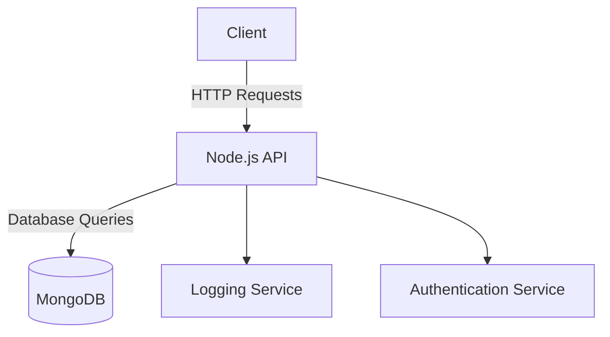
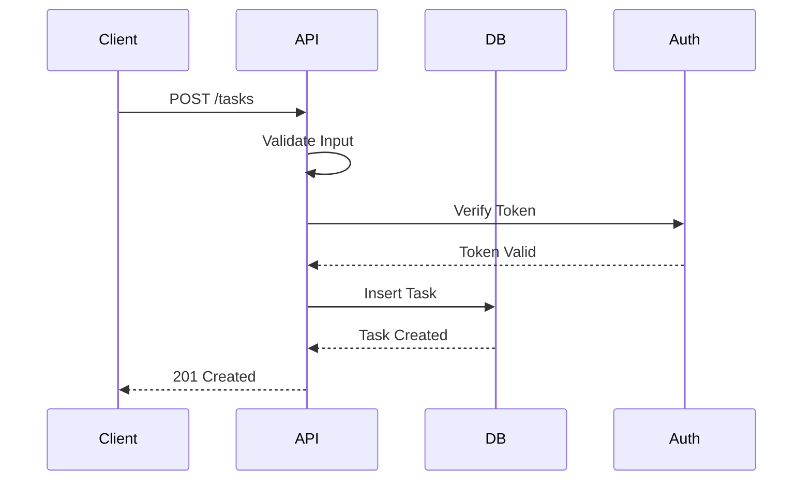

# Sample Node.js Application

This document provides an overview of a sample Node.js application, including its architecture and workflow. The document also includes mermaid diagrams to visualize the application's structure and processes.

---

## Application Overview

The sample Node.js application is a RESTful API that allows users to manage tasks. It includes the following features:
- User authentication
- CRUD operations for tasks
- Error handling and logging

---

## Architecture Diagram

The architecture of the application is visualized below:


```mermaid
graph TD
    Client -->|HTTP Requests| API[Node.js API]
    API -->|Database Queries| DB[(MongoDB)]
    API --> Logger[Logging Service]
    API --> Auth[Authentication Service]
```

---

## Workflow Diagram

The workflow for creating a new task is shown below:


```mermaid
sequenceDiagram
    participant Client
    participant API
    participant DB
    Client->>API: POST /tasks
    API->>API: Validate Input
    API->>Auth: Verify Token
    Auth-->>API: Token Valid
    API->>DB: Insert Task
    DB-->>API: Task Created
    API-->>Client: 201 Created
```

---

## Getting Started

To run the application locally, follow these steps:

1. Clone the repository:
   ```bash
   git clone https://github.com/your-repo/sample-nodejs-app.git
   cd sample-nodejs-app
   ```

2. Install dependencies:
   ```bash
   npm install
   ```

3. Start the application:
   ```bash
   npm start
   ```

4. Access the API at `http://localhost:3000`.

---

## Reference Links

- [Node.js Documentation](https://nodejs.org/en/docs/)
- [Express.js Documentation](https://expressjs.com/)
- [MongoDB Documentation](https://www.mongodb.com/docs/)
- [Mermaid Documentation](https://mermaid-js.github.io/mermaid/)
